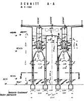
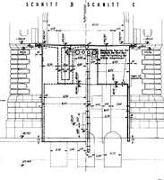
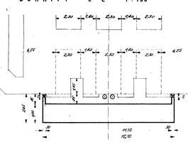
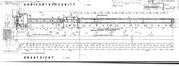
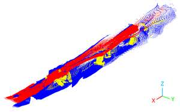
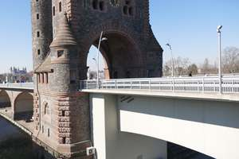
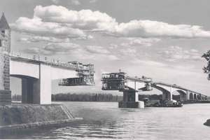
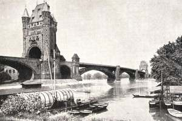
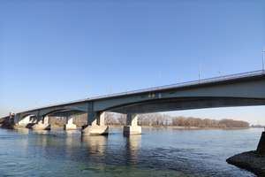
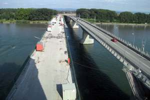

# SPARQL results - CQ 1
Which information is available for the front area of the asset? 

| # | entitySpace | relationLabel | referenceSpace | path (resource)                                                                       |
|---|---|---|---|---------------------------------------------------------------------------------------|
| 1 | http://example.org/SCHNITT_A-A | at the rear side of | http://example.org/Span_1 |                        |
| 2 | http://example.org/SCHNITT_B_SCHNITT_C | is at the front of | http://example.org/Span_1 |                |
| 3 | http://example.org/SCHNITT_D-D | at the rear side of | http://example.org/Span_1 |                        |
| 4 | http://example.org/SCHNITT_E-E | in front of | http://example.org/NibelungenBridge |                        |
| 5 | http://example.org/SCHNITT_E-E | is contained in the front area of | http://example.org/NibelungenBridge |                        |
| 6 | http://example.org/HORIZONTALSCHNITT | is contained in the front area of | http://example.org/NibelungenBridge |                  |
| 7 | http://example.org/Trimmed_Reconstruction_PointCloud | is at the front of | http://example.org/NibelungenBridge |  |
| 8 | http://example.org/LÄNGSSCHNITT | is at the front of | http://example.org/NibelungenBridge |                       |
| 9 | http://example.org/Camera_nb_ambiguous | is contained in the longitudinal central area of | http://example.org/Trimmed_Reconstruction_PointCloud |                       |
| 10 | http://example.org/Camera_nb_detail | is contained in the front area of | http://example.org/Trimmed_Reconstruction_PointCloud |                          |
| 11 | http://example.org/Camera_nb_historic1950 | in front of | http://example.org/Trimmed_Reconstruction_PointCloud |                    |
| 12 | http://example.org/Camera_nb_historic1990 | in front of | http://example.org/Trimmed_Reconstruction_PointCloud |                    |
| 13 | http://example.org/Camera_nb_init_set3 | is contained in the longitudinal central area of | http://example.org/Trimmed_Reconstruction_PointCloud |                       |
| 14 | http://example.org/Camera_nb_init_set4 | is contained in the front area of | http://example.org/Trimmed_Reconstruction_PointCloud |                       |
| 15 | http://example.org/Camera_nb_renovation | is contained in the front area of | http://example.org/Trimmed_Reconstruction_PointCloud |                      |