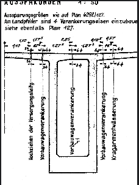
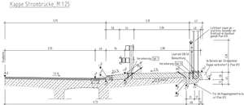
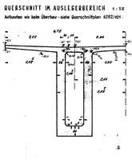
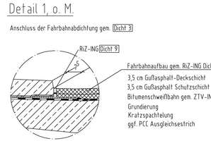
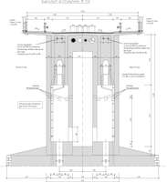
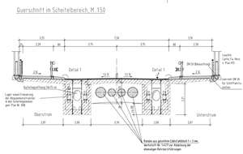
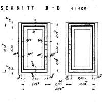
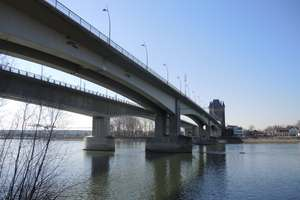
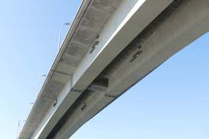

# SPARQL results - CQ 2 
What other resources provide information about the same location of the asset as the view "AUSSPARUNGEN Area Space"?
- Aussparungen Asset Space (Input space): 
- 

| # | otherEntitySpace | locationDescription                                                                                                                  | refSpace | path |
|---|---|--------------------------------------------------------------------------------------------------------------------------------------|---|---|
| 1 | http://example.org/Kappe_Strombrücke__M_1_25 | is contained in the longitudinal central area of, is contained in the transversal central area of, is contained in the right area of | http://example.org/NibelungenBridge |  |
| 2 | http://example.org/QUERSCHNITT_IM_AUSLEGERBEREICH | is contained in the longitudinal central area of, is contained in the transversal central area of                                    | http://example.org/NibelungenBridge |  |
| 3 | http://example.org/Detail_1__o__M_ | is contained in the longitudinal central area of, is contained in the transversal central area of                                    | http://example.org/NibelungenBridge |  |
| 4 | http://example.org/Querschnitt_im_Strompfeiler__M__1_50 | at the top side of                                                                                                                   | http://example.org/NibelungenBridge |  |
| 5 | http://example.org/Querschnitt_im_Scheitelbereich__M__1_50 | is at the bottom of                                                                                                                  | http://example.org/SuperStructureZone |  |
| 6 | http://example.org/SCHNITT_D-D | is contained in the right area of                                                                                                    | http://example.org/NibelungenBridge |  |
| 7 | http://example.org/Camera_nb_init_set3 | is contained in the longitudinal central area of                                                                                     | http://example.org/NibelungenBridge |  |
| 8 | http://example.org/Camera_nb_ambiguous | is contained in the longitudinal central area of                                                                                     | http://example.org/NibelungenBridge |  |
| 9 | http://example.org/QUERSCHNITT_IM_AUSLEGERBEREICH | is at the bottom of                                                                                                                  | http://example.org/SuperStructureZone |  |
| 10 | http://example.org/Querschnitt_im_Scheitelbereich__M__1_50 | at the top side of                                                                                                                   | http://example.org/NibelungenBridge |  |
