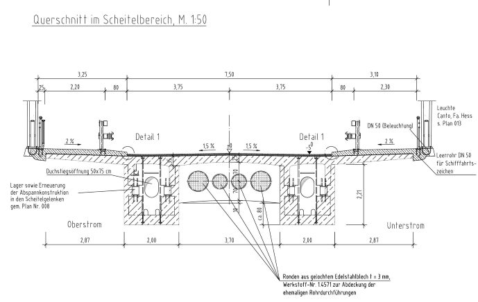

# SPARQL results - CQ 3 
What other resources provide spatially complementary information to 'Querschnitt im Scheitelbereich, M. 1:50'?
- Querschnitt im Scheitelbereich, M. 1:50 (Input space):
- 

| # | otherEntitySpace | locationDescription | refSpace | path |
|---|---|-----------------------------------------------|---|---|
| 1 | http://example.org/LÄNGSSCHNITT | is contained in the longitudinal central area of | http://example.org/Span_2 |  |
| 2 | http://example.org/HORIZONTALSCHNITT | is contained in the longitudinal central area of | http://example.org/Span_2 |  |