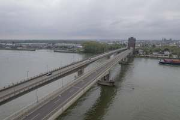
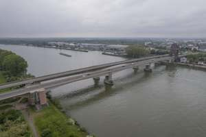

# SPARQL results - CQ 4
Where was {this picture} taken and in which direction does it view? (What part of the asset is shown?)

| # | img | cameraLocation | viewingDirection | viewingDirectionAccuracy | refSpace | path |
|---|---|---|---|---|---|---|
| 1 | http://example.org/Camera_nb_ambiguous | is contained in the longitudinal central area of, is contained in the lower area of, right of | https://w3id.org/spot#Front | https://w3id.org/spot/am#Broad | http://example.org/NibelungenBridge |  |
| 2 | http://example.org/Camera_nb_detail | is contained in the front area of, is contained in the upper area of, right of | https://w3id.org/spot#Front | https://w3id.org/spot/am#Broad | http://example.org/NibelungenBridge |  |
| 3 | http://example.org/Camera_nb_historic1950 | in front of, under, right of | https://w3id.org/spot#Rear | https://w3id.org/spot/am#Approximate | http://example.org/NibelungenBridge |  |
| 4 | http://example.org/Camera_nb_historic1990 | in front of, under, right of | https://w3id.org/spot#Rear | https://w3id.org/spot/am#Broad | http://example.org/NibelungenBridge |  |
| 5 | http://example.org/Camera_nb_init_set1 | is contained in the rear area of, above, left of | https://w3id.org/spot#Front | https://w3id.org/spot/am#Approximate | http://example.org/NibelungenBridge |  |
| 6 | http://example.org/Camera_nb_init_set2 | left of, above, is contained in the rear area of | https://w3id.org/spot#Right | https://w3id.org/spot/am#Broad | http://example.org/NibelungenBridge |  |
| 7 | http://example.org/Camera_nb_init_set3 | is contained in the longitudinal central area of, is contained in the vertical central area of, left of | https://w3id.org/spot#Front | https://w3id.org/spot/am#Approximate | http://example.org/NibelungenBridge |  |
| 8 | http://example.org/Camera_nb_init_set4 | is contained in the front area of, is contained in the vertical central area of, left of | https://w3id.org/spot#Rear | https://w3id.org/spot/am#Broad | http://example.org/NibelungenBridge |  |
| 9 | http://example.org/Camera_nb_renovation | is contained in the front area of, above, right of | https://w3id.org/spot#Rear | https://w3id.org/spot/am#Approximate | http://example.org/NibelungenBridge |  |