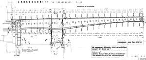
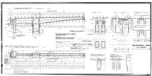

# SPARQL results - CQ 5
In which document is this 'LÄNGSSCHNITT' located, and where on that document?
- LÄNGSSCHNITT (Input space):
- 

| # | var | relationLabel | refSpace | refSpaceDesc | path |
|---|---|---|---|---|---|
| 1 | http://example.org/LÄNGSSCHNITT | is contained in the upper area of | http://example.org/6292_202e | Bau Nibelungenbrücke Linker Landuberbau Schalplan |  |
| 2 | http://example.org/LÄNGSSCHNITT | is contained in the vertical central area of | http://example.org/6292_202e | Bau Nibelungenbrücke Linker Landuberbau Schalplan |  |
| 3 | http://example.org/LÄNGSSCHNITT | is contained in the left area of | http://example.org/6292_202e | Bau Nibelungenbrücke Linker Landuberbau Schalplan |  |
| 4 | http://example.org/LÄNGSSCHNITT | is contained in the transversal central area of | http://example.org/6292_202e | Bau Nibelungenbrücke Linker Landuberbau Schalplan |  |